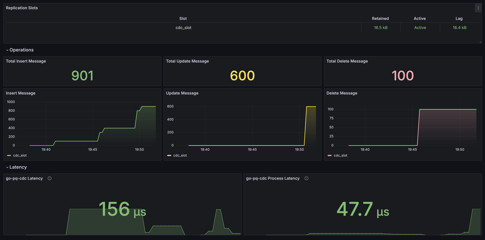

# go-pq-cdc [](https://pkg.go.dev/github.com/Trendyol/go-pq-cdc) [](https://goreportcard.com/report/github.com/Trendyol/go-pq-cdc) [](https://scorecard.dev/viewer/?uri=github.com/Trendyol/go-pq-cdc)

go-pq-cdc is designed to provide efficient and lightweight Change Data Capture (CDC) for PostgreSQL databases.
The architecture leverages PostgreSQL's built-in logical replication capabilities to capture changes in the database and
stream these changes to downstream systems, such as Kafka, Elasticsearch etc. The entire system is written in Golang,
ensuring low resource consumption and high performance.

[Debezium vs go-pq-cdc benchmark](./benchmark)

## 📸 NEW: Snapshot Feature

**Capture existing data before starting CDC!** The new snapshot feature enables initial data synchronization, ensuring downstream systems receive both historical and real-time data.

✨ **Key Highlights:**
- **Zero Data Loss**: Consistent point-in-time snapshot using PostgreSQL's `pg_export_snapshot()`
- **Chunk-Based Processing**: Memory-efficient processing of large tables
- **Multi-Instance Support**: Parallel processing across multiple instances
- **Crash Recovery**: Automatic resume from failures
- **No Duplicates**: Seamless transition from snapshot to CDC
- **Snapshot Only Mode**: One-time data export without CDC (no replication slot required)

📚 **[Read Full Documentation](./SNAPSHOT_FEATURE.md)** for detailed architecture, configuration, and best practices.

### Contents

- [go-pq-cdc   ](#go-pq-cdc---)
	- [📸 NEW: Snapshot Feature](#-new-snapshot-feature)
		- [Contents](#contents)
		- [Why?](#why)
		- [Usage](#usage)
		- [Examples](#examples)
		- [Availability](#availability)
		- [Configuration](#configuration)
		- [API](#api)
		- [Exposed Metrics](#exposed-metrics)
		- [Grafana Dashboard](#grafana-dashboard)
		- [Compatibility](#compatibility)
		- [Breaking Changes](#breaking-changes)

### Why?

CDC systems are crucial for real-time data synchronization, analytics, and event-driven architectures.
Our main goal is to build a cdc base library for faster and stateful systems.

- [Postgresql to Elasticsearch Connector](https://github.com/Trendyol/go-pq-cdc-elasticsearch)
- [Postgresql to Kafka Connector](https://github.com/Trendyol/go-pq-cdc-kafka)

### Usage

```sh
go get github.com/Trendyol/go-pq-cdc
```

```go
package main

import (
	"context"
	cdc "github.com/Trendyol/go-pq-cdc"
	"github.com/Trendyol/go-pq-cdc/config"
	"github.com/Trendyol/go-pq-cdc/pq/message/format"
	"github.com/Trendyol/go-pq-cdc/pq/publication"
	"github.com/Trendyol/go-pq-cdc/pq/replication"
	"github.com/Trendyol/go-pq-cdc/pq/slot"
	"log/slog"
	"os"
)

func main() {
	ctx := context.Background()
	cfg := config.Config{
		Host:      "127.0.0.1",
		Username:  "cdc_user",
		Password:  "cdc_pass",
		Database:  "cdc_db",
		DebugMode: false,
		Publication: publication.Config{
			CreateIfNotExists: true,
			Name: "cdc_publication",
			Operations: publication.Operations{
				publication.OperationInsert,
				publication.OperationDelete,
				publication.OperationTruncate,
				publication.OperationUpdate,
			},
			Tables: publication.Tables{publication.Table{
				Name:            "users",
				ReplicaIdentity: publication.ReplicaIdentityFull,
			}},
		},
		Slot: slot.Config{
			Name:                        "cdc_slot",
			CreateIfNotExists:           true,
			SlotActivityCheckerInterval: 3000,
		},
		Metric: config.MetricConfig{
			Port: 8081,
		},
		Logger: config.LoggerConfig{
			LogLevel: slog.LevelInfo,
		},
	}

	connector, err := cdc.NewConnector(ctx, cfg, Handler)
	if err != nil {
		slog.Error("new connector", "error", err)
		os.Exit(1)
	}

	defer connector.Close()
	connector.Start(ctx)
}

func Handler(ctx *replication.ListenerContext) {
	switch msg := ctx.Message.(type) {
	case *format.Insert:
		slog.Info("insert message received", "new", msg.Decoded)
	case *format.Delete:
		slog.Info("delete message received", "old", msg.OldDecoded)
	case *format.Update:
		slog.Info("update message received", "new", msg.NewDecoded, "old", msg.OldDecoded)
	}

	if err := ctx.Ack(); err != nil {
		slog.Error("ack", "error", err)
	}
}

```

### Examples

* [Simple](./example/simple)
* [Simple File Config](./example/simple-file-config)
* [Snapshot Mode (Initial Data Capture)](./example/snapshotmode)
* [Snapshot Only Mode (One-Time Export)](./example/snapshotonlymode)
* [PostgreSQL to Elasticsearch](https://github.com/Trendyol/go-pq-cdc-elasticsearch/tree/main/example/simple)
* [PostgreSQL to Kafka](https://github.com/Trendyol/go-pq-cdc-kafka/tree/main/example/simple)
* [PostgreSQL to PostgreSQL](./example/postgresql)

### Availability

The go-pq-cdc operates in passive/active modes for PostgreSQL change data capture (CDC). Here's how it ensures
availability:

* **Active Mode:** When the PostgreSQL replication slot (slot.name) is active, go-pq-cdc continuously monitors changes
  and streams them to downstream systems as configured.
* **Passive Mode:** If the PostgreSQL replication slot becomes inactive (detected via slot.slotActivityCheckerInterval),
  go-pq-cdc automatically captures the slot again and resumes data capturing. Other deployments also monitor slot
  activity,
  and when detected as inactive, they initiate data capturing.

This setup ensures continuous data synchronization and minimal downtime in capturing database changes.

### Configuration

| Variable                                |   Type   | Required | Default | Description                                                                                           | Options                                                                                                                                            |
|-----------------------------------------|:--------:|:--------:|:-------:|-------------------------------------------------------------------------------------------------------|----------------------------------------------------------------------------------------------------------------------------------------------------|
| `host`                                  |  string  |   yes    |    -    | PostgreSQL host                                                                                       | Should be a valid hostname or IP address. Example: `localhost`.                                                                                    |
| `username`                              |  string  |   yes    |    -    | PostgreSQL username                                                                                   | Should have sufficient privileges to perform required database operations.                                                                         |
| `password`                              |  string  |   yes    |    -    | PostgreSQL password                                                                                   | Keep secure and avoid hardcoding in the source code.                                                                                               |
| `database`                              |  string  |   yes    |    -    | PostgreSQL database                                                                                   | The database must exist and be accessible by the specified user.                                                                                   |
| `debugMode`                             |   bool   |    no    |  false  | For debugging purposes                                                                                | Enables pprof for trace.                                                                                                                           |
| `metric.port`                           |   int    |    no    |  8080   | Set API port                                                                                          | Choose a port that is not in use by other applications.                                                                                            |
| `logger.logLevel`                       |  string  |    no    |  info   | Set logging level                                                                                     | [`DEBUG`, `WARN`, `INFO`, `ERROR`]                                                                                                                 |
| `logger.logger`                         |  Logger  |    no    |  slog   | Set logger                                                                                            | Can be customized with other logging frameworks if `slog` is not used.                                                                             |
| `publication.createIfNotExists`         |   bool   |    no    |    -    | Create publication if not exists. Otherwise, return `publication is not exists` error.                |                                                                                                                                                    |
| `publication.name`                      |  string  |   yes    |    -    | Set PostgreSQL publication name                                                                       | Should be unique within the database.                                                                                                              |
| `publication.operations`                | []string |   yes    |    -    | Set PostgreSQL publication operations. List of operations to track; all or a subset can be specified. | **INSERT:** Track insert operations. <br> **UPDATE:** Track update operations. <br> **DELETE:** Track delete operations.                           |
| `publication.tables`                    | []Table  |   yes    |    -    | Set tables which are tracked by data change capture                                                   | Define multiple tables as needed.                                                                                                                  |
| `publication.tables[i].name`            |  string  |   yes    |    -    | Set the data change captured table name                                                               | Must be a valid table name in the specified database.                                                                                              |
| `publication.tables[i].replicaIdentity` |  string  |   yes    |    -    | Set the data change captured table replica identity [`FULL`, `DEFAULT`]                               | **FULL:** Captures all columns when a row is updated or deleted. <br> **DEFAULT:** Captures only the primary key when a row is updated or deleted. |
| `publication.tables[i].schema`          |  string  |    no    | public  | Set the data change captured table schema name                                                        | Must be a valid table name in the specified database.                                                                                              |
| `slot.createIfNotExists`                |   bool   |    no    |    -    | Create replication slot if not exists. Otherwise, return `replication slot is not exists` error.      |                                                                                                                                                    |
| `slot.name`                             |  string  |   yes    |    -    | Set the logical replication slot name                                                                 | Should be unique and descriptive.                                                                                                                  |
| `slot.slotActivityCheckerInterval`      |   int    |    no    |  1000   | Set the slot activity check interval time in milliseconds                                             | Specify as an integer value in milliseconds (e.g., `1000` for 1 second).                                                                           |
| `snapshot.enabled`                      |   bool   |    no    |  false  | Enable initial snapshot feature                                                                       | When enabled, captures existing data before starting CDC.                                                                                          |
| `snapshot.mode`                         |  string  |    no    |  never  | Snapshot mode: `initial`, `never`, or `snapshot_only`                                                 | **initial:** Take snapshot only if no previous snapshot exists, then start CDC. <br> **never:** Skip snapshot, start CDC immediately. <br> **snapshot_only:** Take snapshot and exit (no CDC, no replication slot required). |
| `snapshot.chunkSize`                    |  int64   |    no    |  8000   | Number of rows per chunk during snapshot                                                              | Adjust based on table size. Larger chunks = fewer chunks but more memory per chunk.                                                               |
| `snapshot.claimTimeout`                 | duration |    no    |  30s    | Timeout to reclaim stale chunks                                                                       | If a worker doesn't send heartbeat for this duration, chunk is reclaimed by another worker.                                                        |
| `snapshot.heartbeatInterval`            | duration |    no    |  5s     | Interval for worker heartbeat updates                                                                 | Workers send heartbeat every N seconds to indicate they're processing a chunk.                                                                     |
| `snapshot.instanceId`                   |  string  |    no    |  auto   | Custom instance identifier (optional)                                                                 | Auto-generated as `hostname-pid` if not specified. Useful for tracking workers.                                                                    |
| `extensionSupport.enableTimescaleDB`    |   bool   |    no    |  false  | Enable support for TimescaleDB hypertables. Ensures proper handling of compressed chunks during replication. |                                                                                                                                                    |

### API

| Endpoint             | Description                                                                               |
|----------------------|-------------------------------------------------------------------------------------------|
| `GET /status`        | Returns a 200 OK status if the client is able to ping the PostgreSQL server successfully. |
| `GET /metrics`       | Prometheus metric endpoint.                                                               |
| `GET /debug/pprof/*` | (Only for `debugMode=true`) [pprof](https://pkg.go.dev/net/http/pprof)                    |

### Exposed Metrics

The client collects relevant metrics related to PostgreSQL change data capture (CDC) and makes them available at
the `/metrics` endpoint.

| Metric Name                                         | Description                                                                                           | Labels         | Value Type |
|-----------------------------------------------------|-------------------------------------------------------------------------------------------------------|----------------|------------|
| go_pq_cdc_update_total                              | The total number of `UPDATE` operations captured on specific tables.                                  | slot_name, host| Counter    |
| go_pq_cdc_delete_total                              | The total number of `DELETE` operations captured on specific tables.                                  | slot_name, host| Counter    |
| go_pq_cdc_insert_total                              | The total number of `INSERT` operations captured on specific tables.                                  | slot_name, host| Counter    |
| go_pq_cdc_cdc_latency_current                       | The current latency in capturing data changes from PostgreSQL.                                        | slot_name, host| Gauge      |
| go_pq_cdc_process_latency_current                   | The current latency in processing the captured data changes.                                          | slot_name, host| Gauge      |
| go_pq_cdc_replication_slot_slot_confirmed_flush_lsn | The last confirmed flush Log Sequence Number (LSN) in the PostgreSQL replication slot.                | slot_name, host| Gauge      |
| go_pq_cdc_replication_slot_slot_current_lsn         | The current Log Sequence Number (LSN) being processed in the PostgreSQL replication slot.             | slot_name, host| Gauge      |
| go_pq_cdc_replication_slot_slot_is_active           | Indicates whether the PostgreSQL replication slot is currently active (1 for active, 0 for inactive). | slot_name, host| Gauge      |
| go_pq_cdc_replication_slot_slot_lag                 | The replication lag measured by the difference between the current LSN and the confirmed flush LSN.   | slot_name, host| Gauge      |
| go_pq_cdc_replication_slot_slot_retained_wal_size   | The size of Write-Ahead Logging (WAL) files retained for the replication slot in bytes.               | slot_name, host| Gauge      |
| go_pq_cdc_snapshot_in_progress                      | Indicates whether snapshot is currently in progress (1 for active, 0 for inactive).                   | slot_name, host| Gauge      |
| go_pq_cdc_snapshot_total_tables                     | Total number of tables to snapshot.                                                                    | slot_name, host| Gauge      |
| go_pq_cdc_snapshot_total_chunks                     | Total number of chunks to process across all tables.                                                   | slot_name, host| Gauge      |
| go_pq_cdc_snapshot_completed_chunks                 | Number of chunks completed in snapshot.                                                                | slot_name, host| Gauge      |
| go_pq_cdc_snapshot_total_rows                       | Total number of rows read during snapshot.                                                             | slot_name, host| Counter    |
| go_pq_cdc_snapshot_duration_seconds                 | Duration of the last snapshot operation in seconds.                                                    | slot_name, host| Gauge      |
| runtime metrics                                     | [Prometheus Collector](https://golang.bg/src/runtime/metrics/description.go)                          | N/A            | N/A        |

### Grafana Dashboard

Import the grafana dashboard [json file](./grafana/dashboard.json).


### Compatibility

| go-pq-cdc Version | Minimum PostgreSQL Server Version |
|-------------------|-----------------------------------|
| 0.0.2 or higher   | 14                                |

### Breaking Changes

| Date taking effect | Version | Change | How to check |
|--------------------|---------|--------|--------------| 
| -                  | -       | -      | -            |

