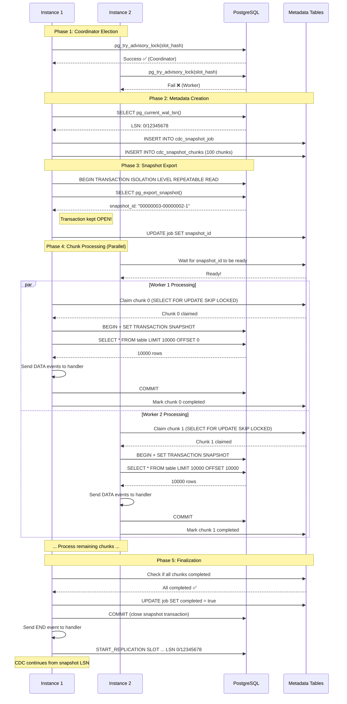

# Snapshot Feature Documentation

## Table of Contents

- [Overview](#overview)
- [Why Snapshot?](#why-snapshot)
- [Architecture](#architecture)
  - [High-Level Design](#high-level-design)
  - [Key Components](#key-components)
  - [Lifecycle Phases](#lifecycle-phases)
- [Getting Started](#getting-started)
  - [Prerequisites](#prerequisites)
  - [Basic Configuration](#basic-configuration)
  - [Simple Example](#simple-example)
- [Configuration Reference](#configuration-reference)
- [How It Works](#how-it-works)
  - [Phase 1: Coordinator Election](#phase-1-coordinator-election)
  - [Phase 2: Metadata Creation](#phase-2-metadata-creation)
  - [Phase 3: Snapshot Export](#phase-3-snapshot-export)
  - [Phase 4: Chunk Processing](#phase-4-chunk-processing)
  - [Phase 5: CDC Continuation](#phase-5-cdc-continuation)
- [Advanced Topics](#advanced-topics)
  - [Multi-Instance Deployment](#multi-instance-deployment)
  - [Crash Recovery](#crash-recovery)
  - [Performance Tuning](#performance-tuning)
- [Monitoring & Observability](#monitoring--observability)
- [Troubleshooting](#troubleshooting)
- [Best Practices](#best-practices)
- [FAQ](#faq)

---

## Overview

The **Snapshot Feature** enables **initial data capture** from PostgreSQL tables before starting Change Data Capture (CDC). This ensures that your downstream systems receive both:

1. **Existing data** (via snapshot)
2. **Real-time changes** (via CDC)

Without snapshot support, CDC only captures changes that occur *after* the replication slot is created, missing all pre-existing data.

### Key Features

✅ **Consistent Point-in-Time Snapshot**: Uses PostgreSQL's `pg_export_snapshot()` for transactional consistency  
✅ **Chunk-Based Processing**: Splits large tables into manageable chunks for memory efficiency  
✅ **Multi-Instance Support**: Multiple instances can collaborate to process chunks in parallel  
✅ **Crash Recovery**: Automatically resumes from where it left off after failures  
✅ **Zero Data Loss**: Ensures no data is missed between snapshot and CDC phases  
✅ **Observability**: Built-in metrics and progress tracking  

---

## Why Snapshot?

### Problem Statement

Consider this scenario:

```
Timeline:
  T0: Table "users" has 1M rows
  T1: You start go-pq-cdc (CDC only)
  T2: 10 new rows inserted
  
Result: You only get 10 rows, missing the initial 1M rows!
```

### Solution

With snapshot enabled:

```
Timeline:
  T0: Table "users" has 1M rows
  T1: You start go-pq-cdc with snapshot enabled
      - Snapshot captures 1M rows at LSN=X
      - Replication slot created at LSN=X
  T2: 10 new rows inserted (at LSN=Y, Y > X)
  T3: Snapshot completes, CDC starts from LSN=X
      - CDC captures the 10 new rows
  
Result: You get all 1M + 10 rows, with no duplicates!
```

### Use Cases

- **Initial Data Migration**: Migrate existing data to Elasticsearch, Kafka, or other systems
- **New Consumer Bootstrap**: Bootstrap new consumers with historical data
- **Disaster Recovery**: Rebuild downstream systems from scratch
- **Analytics**: Sync full dataset for analytics pipelines

---

## Architecture

### High-Level Design

```
┌─────────────────────────────────────────────────────────────────┐
│                        PostgreSQL Database                       │
│                                                                  │
│  ┌──────────────┐    ┌──────────────┐    ┌──────────────┐     │
│  │  Table 1     │    │  Table 2     │    │  Table N     │     │
│  │  (1M rows)   │    │  (500K rows) │    │  (2M rows)   │     │
│  └──────────────┘    └──────────────┘    └──────────────┘     │
│         │                    │                    │             │
│         └────────────────────┴────────────────────┘             │
│                              │                                  │
│                    ┌─────────▼─────────┐                       │
│                    │  Replication Slot │                       │
│                    │   (LSN: 0/12345)  │                       │
│                    └───────────────────┘                       │
└─────────────────────────────────────────────────────────────────┘
                              │
                              │ Logical Replication
                              │
        ┌─────────────────────┴─────────────────────┐
        │                                            │
┌───────▼────────┐                          ┌───────▼────────┐
│   Instance 1   │                          │   Instance 2   │
│  (Coordinator) │◄────Collaboration────────│    (Worker)    │
│                │                          │                │
│ ┌────────────┐ │                          │ ┌────────────┐ │
│ │ Snapshot   │ │                          │ │ Snapshot   │ │
│ │ Engine     │ │                          │ │ Engine     │ │
│ └────────────┘ │                          │ └────────────┘ │
│ ┌────────────┐ │                          │ ┌────────────┐ │
│ │ CDC Stream │ │                          │ │ CDC Stream │ │
│ └────────────┘ │                          │ └────────────┘ │
└────────┬───────┘                          └────────┬───────┘
         │                                           │
         │                                           │
         └─────────────┬───────────────┬────────────┘
                       │               │
                ┌──────▼─────┐  ┌──────▼─────┐
                │   Kafka    │  │ Elastic    │
                └────────────┘  └────────────┘
```

### Key Components

#### 1. **Snapshotter**
The main orchestrator that manages the snapshot lifecycle.

```go
type Snapshotter struct {
    metadataConn       pq.Connection  // Manages job/chunk metadata
    healthcheckConn    pq.Connection  // Heartbeat updates
    exportSnapshotConn pq.Connection  // Keeps snapshot transaction open for only coordinator
    
    dsn     string
    metric  metric.Metric
    typeMap *pgtype.Map
    tables  publication.Tables
    config  config.SnapshotConfig
}
```

#### 2. **Coordinator**
- Elected via PostgreSQL advisory locks
- Creates job metadata and chunks
- Exports snapshot transaction
- Participates in chunk processing (like any other worker)

#### 3. **Worker**
- Claims available chunks (using `SELECT FOR UPDATE SKIP LOCKED`)
- Processes chunk data within snapshot transaction
- Updates progress and heartbeats
- All instances (including coordinator) act as workers

#### 4. **Metadata Tables**

**Job Table** (`cdc_snapshot_job`):
```sql
CREATE TABLE cdc_snapshot_job (
    slot_name        TEXT PRIMARY KEY,
    snapshot_id      TEXT NOT NULL,
    snapshot_lsn     TEXT NOT NULL,
    started_at       TIMESTAMP NOT NULL,
    completed        BOOLEAN DEFAULT FALSE,
    total_chunks     INT NOT NULL DEFAULT 0,
    completed_chunks INT NOT NULL DEFAULT 0
);
```

**Chunks Table** (`cdc_snapshot_chunks`):
```sql
CREATE TABLE cdc_snapshot_chunks (
    id              SERIAL PRIMARY KEY,
    slot_name       TEXT NOT NULL,
    table_schema    TEXT NOT NULL,
    table_name      TEXT NOT NULL,
    chunk_index     INT NOT NULL,
    chunk_start     BIGINT NOT NULL,
    chunk_size      BIGINT NOT NULL,
    status          TEXT NOT NULL DEFAULT 'pending',
    claimed_by      TEXT,
    claimed_at      TIMESTAMP,
    heartbeat_at    TIMESTAMP,
    completed_at    TIMESTAMP,
    rows_processed  BIGINT DEFAULT 0,
    UNIQUE(slot_name, table_schema, table_name, chunk_index)
);
```

### Lifecycle Phases

**Mermaid Flow Diagram:**



#### Chunking Strategy (How Snapshot Picks Range vs Keyset vs Offset)

We keep the decision tree simple for operators:

- **Step 1: Primary Key inspection**
  - If there is **one integer PK** (`smallint`, `integer`, `bigint`), range/keyset is allowed.
  - Otherwise → **Offset mode** (fallback).

- **Step 2: Bounds & row count**
  - Read `MIN(pk)`, `MAX(pk)`, `COUNT(*)`.
  - If `COUNT(*) == 0` → single chunk (empty table).

- **Step 3: Sparsity check (snowflake-style IDs)**
  - `sparsityRatio = (max - min + 1) / rowCount`
  - If `sparsityRatio > 100` **or** projected range chunks would exceed `maxChunksPerTable = 1,000,000`:
    - Use **Keyset mode** (exact boundaries via `NTILE` when feasible; otherwise sequential keyset).

- **Step 4: Mode selection**
  - **Dense PK** (sparsity ok) → **Range mode**  
    `SELECT ... WHERE pk BETWEEN start AND end ORDER BY pk LIMIT chunkSize`
  - **Sparse PK** → **Keyset mode**  
    `SELECT ... WHERE pk > cursor ORDER BY pk LIMIT chunkSize`
  - **No single integer PK** → **Offset mode**  
    `SELECT ... ORDER BY ctid LIMIT ... OFFSET ...`

- **Safety rails**
  - Caps chunk count at `1,000,000` to avoid memory pressure.
  - Uses quoted identifiers for schema/table/column names.
  - Logs chosen mode at `INFO` level (e.g., `"sparse primary key detected, using keyset pagination"`).

##### Concurrency Notes
- **Range mode** and **keyset with NTILE boundaries**: chunks are independent; multiple pods process the same table in parallel.
- **Sequential keyset mode** (used only when sparsity is extreme and NTILE is not feasible): chunks of that table advance one-by-one; adding pods does not speed that table, but other tables still run in parallel.
- **Offset mode**: chunks are independent; multiple pods can process in parallel.

##### Operator override
- Config key: `snapshot.chunkingMode` (`auto` | `range` | `keyset` | `offset`)
- Default is `auto` (decision tree above). Overrides:
  - `range`: force range chunking (requires single integer PK; else falls back to offset).
  - `keyset`: force keyset (requires single integer PK + bounds + row count; else falls back to offset).
  - `offset`: force offset (order by `ctid`, suitable if you want to avoid range/keyset or have no PK).

**ASCII Diagram:**

```
┌──────────────────────────────────────────────────────────────┐
│                    Snapshot Lifecycle                         │
└──────────────────────────────────────────────────────────────┘

Phase 1: Coordinator Election
───────────────────────────────
   ┌─────────┐
   │Instance1│──pg_try_advisory_lock()──► Success (Coordinator)
   └─────────┘
   ┌─────────┐
   │Instance2│──pg_try_advisory_lock()──► Fail (Worker)
   └─────────┘
                    │
                    ▼
Phase 2: Metadata Creation (Coordinator Only)
──────────────────────────────────────────────
   • Capture current LSN (e.g., 0/12345678)
   • Create job metadata
   • Split tables into chunks:
       - Table 1: 1M rows → 10 chunks (100K each)
       - Table 2: 500K rows → 5 chunks
   • Save chunks to DB
                    │
                    ▼
Phase 3: Snapshot Export (Coordinator Only)
────────────────────────────────────────────
   • BEGIN TRANSACTION ISOLATION LEVEL REPEATABLE READ
   • SELECT pg_export_snapshot() → "00000003-00000002-1"
   • Keep transaction OPEN (critical!)
   • Update job with snapshot_id
   • Workers can now join
                    │
                    ▼
Phase 4: Chunk Processing (All Instances)
──────────────────────────────────────────
   Worker Loop:
   ┌─► Claim next chunk (SELECT FOR UPDATE SKIP LOCKED)
   │   │
   │   ├─► BEGIN TRANSACTION
   │   ├─► SET TRANSACTION SNAPSHOT 'snapshot_id'
   │   ├─► SELECT * FROM table LIMIT X OFFSET Y
   │   ├─► Send DATA events to handler
   │   ├─► COMMIT
   │   ├─► Mark chunk completed
   │   │
   └───┴── Repeat until no chunks left
                    │
                    ▼
Phase 5: CDC Continuation
──────────────────────────
   • All chunks completed
   • Snapshot transaction closed
   • CDC starts from snapshot LSN
   • No duplicate data!
```

---

## Getting Started

### Prerequisites

1. **PostgreSQL 14+** with logical replication enabled:
   ```sql
   -- Check wal_level
   SHOW wal_level;  -- Must be 'logical'
   
   -- Check max_replication_slots
   SHOW max_replication_slots;  -- Must be > 0
   ```

2. **User Permissions**:
   ```sql
   -- Grant replication privilege
   ALTER USER your_user WITH REPLICATION;
   
   -- Grant access to tables
   GRANT SELECT ON ALL TABLES IN SCHEMA public TO your_user;
   ```

3. **Configure PostgreSQL** (`postgresql.conf`):
   ```ini
   wal_level = logical
   max_replication_slots = 10
   max_wal_senders = 10
   ```

### Basic Configuration

```yaml
# config.yml
host: localhost
database: mydb
port: 5432
username: cdc_user
password: cdc_pass

publication:
  name: cdc_publication
  createIfNotExists: true
  operations:
    - INSERT
    - UPDATE
    - DELETE
  tables:
    - name: users
      schema: public
      replicaIdentity: FULL
    - name: orders
      schema: public
      replicaIdentity: FULL

slot:
  name: cdc_slot
  createIfNotExists: true
  slotActivityCheckerInterval: 3000

# Snapshot Configuration
snapshot:
  enabled: true                # Enable snapshot feature
  mode: initial                # Take snapshot only if not completed before
  chunkSize: 10000             # Rows per chunk
  claimTimeout: 30s            # Reclaim stale chunks after 30s
  heartbeatInterval: 10s       # Send heartbeat every 10s

logger:
  logLevel: info

metric:
  port: 8081
```

### Simple Example

```go
package main

import (
    "context"
    "log"
    "encoding/json"
    
    cdc "github.com/Trendyol/go-pq-cdc"
    "github.com/Trendyol/go-pq-cdc/config"
    "github.com/Trendyol/go-pq-cdc/pq/message/format"
    "github.com/Trendyol/go-pq-cdc/pq/replication"
)

func main() {
    ctx := context.Background()
    
    // Load configuration
    cfg, err := config.ReadConfigYAML("config.yml")
    if err != nil {
        log.Fatal(err)
    }
    
    // Create connector with snapshot support
    connector, err := cdc.NewConnector(ctx, cfg, handleMessage)
    if err != nil {
        log.Fatal(err)
    }
    defer connector.Close()
    
    // Start (snapshot + CDC)
    connector.Start(ctx)
}

func handleMessage(ctx *replication.ListenerContext) {
    switch msg := ctx.Message.(type) {
    
    // Snapshot events
    case *format.Snapshot:
        handleSnapshot(msg)
        
    // CDC events
    case *format.Insert:
        log.Printf("INSERT: %v", msg.Decoded)
    case *format.Update:
        log.Printf("UPDATE: %v -> %v", msg.OldDecoded, msg.NewDecoded)
    case *format.Delete:
        log.Printf("DELETE: %v", msg.OldDecoded)
    }
    
    if err := ctx.Ack(); err != nil {
        log.Printf("ACK error: %v", err)
    }
}

func handleSnapshot(s *format.Snapshot) {
    switch s.EventType {
    case format.SnapshotEventTypeBegin:
        log.Printf("📸 Snapshot BEGIN | LSN: %s", s.LSN.String())
        
    case format.SnapshotEventTypeData:
        data, _ := json.Marshal(s.Data)
        log.Printf("📸 Snapshot DATA | Table: %s.%s | Data: %s",
            s.Schema, s.Table, string(data))
        
    case format.SnapshotEventTypeEnd:
        log.Printf("📸 Snapshot END | LSN: %s", s.LSN.String())
    }
}
```

### Expected Output

```
INFO: publication created: cdc_publication
INFO: system identification: systemID=... timeline=1 xLogPos=0/12345678
INFO: [coordinator] elected as coordinator instanceID=host-12345
INFO: [coordinator] chunks created table=users chunks=10
INFO: [coordinator] chunks created table=orders chunks=5
INFO: [coordinator] snapshot exported snapshotID=00000003-00000002-1
INFO: replication slot created: cdc_slot restartLSN=0/12345678
📸 Snapshot BEGIN | LSN: 0/12345678
📸 Snapshot DATA | Table: public.users | Data: {"id":1,"name":"Alice"}
📸 Snapshot DATA | Table: public.users | Data: {"id":2,"name":"Bob"}
...
📸 Snapshot DATA | Table: public.orders | Data: {"id":101,"user_id":1}
...
📸 Snapshot END | LSN: 0/12345678
INFO: snapshot completed successfully
INFO: CDC will continue from LSN: 0/12345678
INSERT: map[id:1001 name:Charlie]  <-- New data after snapshot
```

---

## Configuration Reference

### Snapshot Configuration Options

| Parameter | Type | Default | Description |
|-----------|------|---------|-------------|
| `enabled` | bool | `false` | Enable/disable snapshot feature |
| `mode` | string | `never` | Snapshot mode: `initial` or `never` |
| `chunkSize` | int64 | `8000` | Number of rows per chunk |
| `claimTimeout` | duration | `30s` | Timeout to reclaim stale chunks |
| `heartbeatInterval` | duration | `5s` | Interval for worker heartbeat updates |
| `instanceId` | string | `hostname-pid` | Custom instance identifier (optional) |

### Snapshot Modes

#### `initial` Mode
```yaml
snapshot:
  mode: initial
```
- Takes snapshot **only once** (on first run)
- Checks if job is already completed
- If completed, skips snapshot and goes directly to CDC
- **Recommended for production**

#### `never` Mode
```yaml
snapshot:
  mode: never
```
- Never takes snapshot
- Always starts CDC from current point
- Use when you don't need historical data

#### `snapshot_only` Mode
```yaml
snapshot:
  enabled: true
  mode: snapshot_only
  chunkSize: 10000
```
- Takes snapshot and **exits** (finite mode, no CDC)
- No replication slot or publication required
- Process terminates after snapshot completes
- Similar to Debezium's snapshot-only mode
- **Multi-pod safe**: Coordinator election enables parallel processing
- **Resume capability**: Automatically continues if interrupted
- **Use case**: One-time data export, initial data migration

**Key Differences from `initial` mode:**

| Feature | `initial` Mode | `snapshot_only` Mode |
|---------|---------------|---------------------|
| CDC after snapshot | ✅ Yes | ❌ No |
| Replication slot | ✅ Required | ❌ Not created |
| Publication | ✅ Required | ❌ Optional |
| Process behavior | Continuous | Exits after snapshot |
| Use case | CDC with bootstrap | One-time export |

**Minimal Configuration Example:**

```yaml
host: localhost
database: mydb
username: user
password: pass

# Publication and slot NOT required for snapshot_only
# Can be omitted or left empty

publication:
  tables:
    - name: users
      schema: public
    - name: orders
      schema: public

snapshot:
  enabled: true
  mode: snapshot_only
  chunkSize: 10000

metric:
  port: 8081
```

**Multi-Pod Deployment:**

Multiple pods can run simultaneously for faster snapshot:

```yaml
# Same config on all pods
snapshot:
  enabled: true
  mode: snapshot_only
  chunkSize: 10000

# All pods will:
# - Use consistent slot name: "snapshot_only_<database>"
# - Participate in coordinator election (one becomes coordinator)
# - Process chunks in parallel (work together)
# - Resume if any pod crashes (no duplicate work)
```

**Resume on Failure:**

If snapshot is interrupted (pod crash, network issue), simply restart:

```bash
# Run 1: Process 500/1000 chunks → CRASH
# Run 2: Automatically continues from chunk 501 ✅
```

**Output Example:**

```
INFO: snapshot-only mode enabled, tables=2
INFO: starting snapshot-only execution slotName=snapshot_only_mydb
INFO: [snapshot] elected as coordinator instanceID=pod-1-abc123
INFO: snapshot prepared snapshotLSN=0/12345678
📸 Snapshot BEGIN | LSN: 0/12345678
📸 Snapshot DATA | Table: public.users | Data: {"id":1,"name":"Alice"}
📸 Snapshot DATA | Table: public.users | Data: {"id":2,"name":"Bob"}
...
📸 Snapshot END | LSN: 0/12345678
INFO: snapshot data collection completed snapshotLSN=0/12345678
INFO: snapshot-only completed successfully, exiting
```

**Multi-Pod Output Example:**

```
# Pod 1 (Coordinator):
INFO: snapshot-only mode enabled, tables=2
INFO: starting snapshot-only execution slotName=snapshot_only_mydb
INFO: [coordinator] elected as coordinator instanceID=pod-1
INFO: [coordinator] chunks created table=users chunks=100
INFO: [worker] processing chunk table=users chunkIndex=0

# Pod 2 (Worker):
INFO: snapshot-only mode enabled, tables=2
INFO: starting snapshot-only execution slotName=snapshot_only_mydb
INFO: [snapshot] joining as worker instanceID=pod-2
INFO: [worker] processing chunk table=users chunkIndex=1

# Both pods work together, exit when done
```

---

## How It Works

### Phase 1: Coordinator Election

When multiple instances start simultaneously, they need to elect a coordinator:

```go
// Each instance tries to acquire advisory lock
lockID := hashString(slotName)  // e.g., "cdc_slot" -> 12345
acquired := SELECT pg_try_advisory_lock(lockID)

if acquired {
    // This instance becomes COORDINATOR
    // Responsibilities:
    //   1. Capture current LSN
    //   2. Create job metadata
    //   3. Split tables into chunks
    //   4. Export snapshot transaction
    //   5. Participate in chunk processing (as worker)
} else {
    // This instance becomes WORKER
    // Responsibilities:
    //   1. Wait for coordinator to finish setup
    //   2. Participate in chunk processing
}
```

**Key Points:**
- Uses PostgreSQL advisory locks for coordination
- Lock is held during setup phase only
- Advisory locks are automatically released on connection close
- Workers wait for coordinator by polling job metadata

### Phase 2: Metadata Creation

Coordinator creates job and chunk metadata:

```go
// 1. Capture current LSN
currentLSN := SELECT pg_current_wal_lsn()  // e.g., "0/12345678"

// 2. Create job metadata
INSERT INTO cdc_snapshot_job (
    slot_name, snapshot_id, snapshot_lsn, started_at,
    completed, total_chunks, completed_chunks
) VALUES (
    'cdc_slot', 'PENDING', '0/12345678', NOW(),
    false, 0, 0
)

// 3. Split tables into chunks
for each table in publication.tables {
    rowCount := SELECT COUNT(*) FROM schema.table
    numChunks := ceiling(rowCount / chunkSize)
    
    for i := 0 to numChunks-1 {
        INSERT INTO cdc_snapshot_chunks (
            slot_name, table_schema, table_name,
            chunk_index, chunk_start, chunk_size, status
        ) VALUES (
            'cdc_slot', 'public', 'users',
            i, i * chunkSize, chunkSize, 'pending'
        )
    }
}
```

**Why Chunks?**

Without chunking:
```sql
-- ❌ Problem: Loads entire table into memory (OOM risk!)
SELECT * FROM users;  -- 10M rows → 1GB+ memory
```

With chunking:
```sql
-- ✅ Solution: Process in batches
SELECT * FROM users ORDER BY id LIMIT 10000 OFFSET 0;      -- Chunk 0
SELECT * FROM users ORDER BY id LIMIT 10000 OFFSET 10000;  -- Chunk 1
...
```

### Phase 3: Snapshot Export

Coordinator exports a PostgreSQL snapshot:

```go
// 1. Start transaction (REPEATABLE READ for consistency)
BEGIN TRANSACTION ISOLATION LEVEL REPEATABLE READ

// 2. Export snapshot
snapshotID := SELECT pg_export_snapshot()  
// Returns: "00000003-00000002-1"

// 3. Keep transaction OPEN!
// (Do NOT commit/rollback yet)

// 4. Update job metadata
UPDATE cdc_snapshot_job 
SET snapshot_id = '00000003-00000002-1'
WHERE slot_name = 'cdc_slot'
```

**Critical: Why Keep Transaction Open?**

```
┌─────────────────────────────────────────────────────────────┐
│  Coordinator Transaction (REPEATABLE READ)                  │
│  ┌────────────────────────────────────────────────────┐    │
│  │ BEGIN                                               │    │
│  │ SELECT pg_export_snapshot() → 'snapshot_123'       │    │
│  │ ... (transaction stays open) ...                   │    │
│  │                                                     │    │
│  │  ┌──────────────────────────────────────────────┐ │    │
│  │  │ Worker 1: SET TRANSACTION SNAPSHOT 'snap123' │ │    │
│  │  │ SELECT * FROM users ... (sees same data!)    │ │    │
│  │  └──────────────────────────────────────────────┘ │    │
│  │                                                     │    │
│  │  ┌──────────────────────────────────────────────┐ │    │
│  │  │ Worker 2: SET TRANSACTION SNAPSHOT 'snap123' │ │    │
│  │  │ SELECT * FROM orders ... (sees same data!)   │ │    │
│  │  └──────────────────────────────────────────────┘ │    │
│  │                                                     │    │
│  │ COMMIT (after all chunks done)                     │    │
│  └────────────────────────────────────────────────┘    │
└─────────────────────────────────────────────────────────────┘

If coordinator closed transaction early:
  ❌ Snapshot ID becomes invalid
  ❌ Workers can't use SET TRANSACTION SNAPSHOT
  ❌ Data inconsistency across chunks
```

### Phase 4: Chunk Processing

All instances (coordinator + workers) process chunks in parallel:

```go
for {
    // 1. Claim a chunk (atomic, lock-free)
    chunk := UPDATE cdc_snapshot_chunks
             SET status = 'in_progress',
                 claimed_by = 'instance-123',
                 claimed_at = NOW(),
                 heartbeat_at = NOW()
             WHERE id IN (
                 SELECT id FROM cdc_snapshot_chunks
                 WHERE slot_name = 'cdc_slot'
                   AND (
                       status = 'pending'
                       OR (status = 'in_progress' AND heartbeat_at < NOW() - 30s)
                   )
                 ORDER BY chunk_index
                 LIMIT 1
                 FOR UPDATE SKIP LOCKED
             )
             RETURNING *
    
    if chunk == nil {
        break  // No more chunks
    }
    
    // 2. Process chunk in snapshot transaction
    BEGIN TRANSACTION ISOLATION LEVEL REPEATABLE READ
    SET TRANSACTION SNAPSHOT 'snapshot_123'
    
    query := SELECT * FROM users 
             ORDER BY id 
             LIMIT chunk.chunk_size 
             OFFSET chunk.chunk_start
    
    rows := execute(query)
    
    for row in rows {
        handler(&format.Snapshot{
            EventType: format.SnapshotEventTypeData,
            Schema:    "public",
            Table:     "users",
            Data:      row,
            LSN:       snapshotLSN,
        })
    }
    
    COMMIT
    
    // 3. Mark chunk completed
    UPDATE cdc_snapshot_chunks
    SET status = 'completed',
        completed_at = NOW(),
        rows_processed = len(rows)
    WHERE id = chunk.id
    
    // 4. Update job progress
    UPDATE cdc_snapshot_job
    SET completed_chunks = completed_chunks + 1
    WHERE slot_name = 'cdc_slot'
}
```

**Key Features:**

1. **Lock-Free Claiming**: `SELECT FOR UPDATE SKIP LOCKED` prevents contention
2. **Chunk Isolation**: Each chunk has its own transaction
3. **Stale Chunk Reclaim**: Chunks with old heartbeats are reclaimed
4. **Ordered Processing**: `ORDER BY chunk_index` for predictable order

**Heartbeat Mechanism:**

```go
// Background goroutine per worker
go func() {
    ticker := time.NewTicker(10 * time.Second)
    for {
        select {
        case <-ticker.C:
            UPDATE cdc_snapshot_chunks
            SET heartbeat_at = NOW()
            WHERE id = currentChunkID
        case <-ctx.Done():
            return
        }
    }
}()
```

Purpose:
- Detect crashed/frozen workers
- Allow other workers to reclaim stale chunks
- Prevent work duplication

### Phase 5: CDC Continuation

After all chunks are completed:

```go
// 1. Check if all chunks completed
allDone := SELECT COUNT(*) = COUNT(*) FILTER (WHERE status = 'completed')
           FROM cdc_snapshot_chunks
           WHERE slot_name = 'cdc_slot'

if allDone {
    // 2. Mark job as completed
    UPDATE cdc_snapshot_job
    SET completed = true
    WHERE slot_name = 'cdc_slot'
    
    // 3. Close snapshot transaction
    COMMIT  // (on coordinator's export connection)
    
    // 4. Send END marker
    handler(&format.Snapshot{
        EventType: format.SnapshotEventTypeEnd,
        LSN:       snapshotLSN,
    })
    
    // 5. Start CDC from snapshot LSN
    START_REPLICATION SLOT cdc_slot LOGICAL 0/12345678
    // CDC stream starts from where snapshot was taken
}
```

**No Duplicate Data:**

```
Timeline:
─────────────────────────────────────────────────────────────►
         │                    │                    │
         T0                   T1                   T2
    Snapshot LSN         Snapshot End         Current Time
    (0/12345678)
         │                    │                    │
         ├────────────────────┤────────────────────►
         │   Snapshot Data    │    CDC Data        │
         │   (goes to handler)│  (goes to handler) │
         │                    │                    │
         │◄───────────────────┤                    │
         No overlap!    CDC starts from snapshot LSN
```

---

## Advanced Topics

### Multi-Instance Deployment

Deploy multiple instances for faster snapshot processing:

```yaml
# Instance 1
snapshot:
  instanceId: "instance-1"  # Optional: auto-generated (hostname & pid) if not set
  chunkSize: 10000

# Instance 2
snapshot:
  instanceId: "instance-2"
  chunkSize: 10000

# Instance 3
snapshot:
  instanceId: "instance-3"
  chunkSize: 10000
```

**How It Works:**

```
┌─────────────────────────────────────────────────────────────┐
│                     Chunk Work Queue                        │
│  ┌─────┬─────┬─────┬─────┬─────┬─────┬─────┬─────┬─────┐  │
│  │ C0  │ C1  │ C2  │ C3  │ C4  │ C5  │ C6  │ C7  │ C8  │  │
│  │ ◄   │     │     │     │     │     │     │     │     │  │
│  └─────┴─────┴─────┴─────┴─────┴─────┴─────┴─────┴─────┘  │
└─────────────────────────────────────────────────────────────┘
     ▲       ▲       ▲
     │       │       │
┌────┴────┐ ┌┴───────┴┐ ┌─────────┐
│Instance1│ │Instance2│ │Instance3│
│Coord+   │ │Worker   │ │Worker   │
│Worker   │ │         │ │         │
└─────────┘ └─────────┘ └─────────┘

Timeline:
  T0: Instance1 claims C0, Instance2 claims C1, Instance3 claims C2
  T1: Instance1 completes C0, claims C3
  T2: Instance2 completes C1, claims C4
  ...
  TN: All chunks completed → CDC starts
```

**Benefits:**
- **Parallelism**: 3x faster with 3 instances
- **Fault Tolerance**: If one crashes, others continue
- **Auto-Recovery**: Crashed chunks are reclaimed

### Crash Recovery

The system handles crashes gracefully:

#### Scenario 1: Worker Crash During Chunk Processing

```
Before Crash:
┌──────────────────────────────────────────────────────────┐
│ Chunk Status:                                            │
│   C0: completed (by instance-1)                          │
│   C1: completed (by instance-2)                          │
│   C2: in_progress (by instance-3) ← heartbeat stopped    │
│   C3-C9: pending                                         │
└──────────────────────────────────────────────────────────┘

After 30s (claimTimeout):
┌──────────────────────────────────────────────────────────┐
│ Chunk C2 becomes stale (heartbeat_at < NOW() - 30s)     │
│ → instance-1 or instance-2 reclaims C2                   │
│ → C2 reprocessed, no data loss!                          │
└──────────────────────────────────────────────────────────┘
```

#### Scenario 2: Coordinator Crash After Metadata Creation

```
State:
  ✅ Job metadata created
  ✅ Chunks created
  ❌ Snapshot NOT exported yet
  ❌ Coordinator crashed

On Restart:
  1. Instance starts, tries to acquire lock
  2. Detects incomplete job with "PENDING" snapshot_id
  3. Cleans up incomplete job (DELETE job + chunks)
  4. Restarts from scratch
  
Why? Old snapshot is gone, LSN is stale. 
     Must restart to maintain consistency.
```

#### Scenario 3: All Instances Crash, Then Restart

```
State:
  ✅ Job exists, snapshot exported
  ✅ Some chunks completed, some pending/in_progress
  
On Restart:
  1. Instances start
  2. Coordinator election happens
  3. Load existing job
  4. Resume processing:
     - Skip completed chunks
     - Reclaim stale in_progress chunks
     - Process pending chunks
  5. Continue until all done
```

### Performance Tuning

#### 1. Chunk Size Tuning

```yaml
# Small tables (< 100K rows)
snapshot:
  chunkSize: 5000  # Smaller chunks, more overhead but fine-grained

# Medium tables (100K - 1M rows)
snapshot:
  chunkSize: 10000  # Balanced

# Large tables (> 1M rows)
snapshot:
  chunkSize: 50000  # Larger chunks, less overhead
```

**Trade-offs:**
- **Smaller chunks**: More parallelism, more metadata overhead, easier recovery
- **Larger chunks**: Less parallelism, less overhead, longer per-chunk time

#### 2. Heartbeat & Timeout Tuning

```yaml
# Fast failure detection (aggressive)
snapshot:
  heartbeatInterval: 5s
  claimTimeout: 15s

# Slow failure detection (conservative)
snapshot:
  heartbeatInterval: 30s
  claimTimeout: 120s
```

**Guidelines:**
- `claimTimeout` should be at least 3x `heartbeatInterval`
- Shorter intervals = faster failure detection but more DB load
- Longer intervals = less DB load but slower recovery

#### 3. Ordering Strategy

Tables are processed in order, but chunks within a table can be parallel:

```go
// Primary key ordering (preferred)
SELECT * FROM users ORDER BY id LIMIT 10000 OFFSET 0

// Composite key ordering
SELECT * FROM orders ORDER BY user_id, created_at LIMIT 10000 OFFSET 0

// No primary key (fallback to ctid)
SELECT * FROM logs ORDER BY ctid LIMIT 10000 OFFSET 0
```

**Best Practice:** Ensure tables have primary keys for optimal performance.

---

## Monitoring & Observability

### Metrics

All metrics are exposed at `/metrics` endpoint (Prometheus format):

| Metric | Type | Description |
|--------|------|-------------|
| `go_pq_cdc_snapshot_in_progress` | Gauge | 1 if snapshot is running, 0 otherwise |
| `go_pq_cdc_snapshot_total_tables` | Gauge | Total number of tables to snapshot |
| `go_pq_cdc_snapshot_total_chunks` | Gauge | Total number of chunks to process |
| `go_pq_cdc_snapshot_completed_chunks` | Gauge | Number of completed chunks |
| `go_pq_cdc_snapshot_total_rows` | Counter | Total rows processed in snapshot |
| `go_pq_cdc_snapshot_duration_seconds` | Gauge | Duration of last snapshot in seconds |

**Example Query:**

```promql
# Snapshot progress percentage
100 * (
  go_pq_cdc_snapshot_completed_chunks{slot_name="cdc_slot"} 
  / 
  go_pq_cdc_snapshot_total_chunks{slot_name="cdc_slot"}
)

# Snapshot throughput (rows/second)
rate(go_pq_cdc_snapshot_total_rows{slot_name="cdc_slot"}[1m])
```

### Logs

Key log messages to monitor:

```
# Startup
INFO [coordinator] elected as coordinator instanceID=instance-1
INFO [coordinator] chunks created table=users chunks=100
INFO [coordinator] snapshot exported snapshotID=00000003-00000002-1

# Progress
DEBUG [worker] processing chunk table=users chunkIndex=5 chunkStart=50000
DEBUG [worker] chunk completed chunkID=123 rowsProcessed=10000

# Completion
INFO [snapshot] all chunks completed
INFO snapshot completed successfully snapshotLSN=0/12345678

# Errors
WARN [heartbeat] failed to update chunkID=456 error=connection timeout
ERROR [worker] chunk processing failed chunkID=789 error=query timeout
```

### Database Queries for Monitoring

```sql
-- Overall progress
SELECT 
    slot_name,
    completed,
    completed_chunks,
    total_chunks,
    ROUND(100.0 * completed_chunks / NULLIF(total_chunks, 0), 2) as progress_pct,
    snapshot_lsn
FROM cdc_snapshot_job;

-- Chunk breakdown by status
SELECT 
    table_name,
    status,
    COUNT(*) as chunk_count,
    SUM(rows_processed) as total_rows
FROM cdc_snapshot_chunks
WHERE slot_name = 'cdc_slot'
GROUP BY table_name, status
ORDER BY table_name, status;

-- Find stale chunks (potential issues)
SELECT 
    id,
    table_name,
    chunk_index,
    claimed_by,
    status,
    NOW() - heartbeat_at as stale_duration
FROM cdc_snapshot_chunks
WHERE slot_name = 'cdc_slot'
  AND status = 'in_progress'
  AND heartbeat_at < NOW() - INTERVAL '1 minute'
ORDER BY heartbeat_at;

-- Processing timeline
SELECT 
    table_name,
    chunk_index,
    status,
    claimed_by,
    claimed_at,
    completed_at,
    EXTRACT(EPOCH FROM (completed_at - claimed_at)) as duration_seconds,
    rows_processed
FROM cdc_snapshot_chunks
WHERE slot_name = 'cdc_slot'
  AND status = 'completed'
ORDER BY completed_at DESC
LIMIT 20;
```

---

## Troubleshooting

### Problem: Snapshot Takes Too Long

**Symptoms:**
- Snapshot running for hours
- Low throughput (< 1000 rows/sec)

**Causes & Solutions:**

1. **Chunk size too small**
   ```yaml
   # Before
   snapshot:
     chunkSize: 1000  # ❌ Too small, high overhead
   
   # After
   snapshot:
     chunkSize: 10000  # ✅ Better
   ```

2. **Table has no primary key**
   ```sql
   -- Check
   SELECT tablename, indexname 
   FROM pg_indexes 
   WHERE schemaname = 'public' AND indexdef LIKE '%PRIMARY KEY%';
   
   -- Fix
   ALTER TABLE your_table ADD PRIMARY KEY (id);
   ```

3. **Single instance processing**
   ```bash
   # Deploy more instances for parallel processing
   ./app --config config1.yml &
   ./app --config config2.yml &
   ./app --config config3.yml &
   ```

### Problem: Duplicate Data in Consumer

**Symptoms:**
- Same rows appear in both snapshot and CDC events

**Cause:**
- LSN not properly set for CDC continuation

**Debug:**
```sql
-- Check snapshot LSN
SELECT snapshot_lsn FROM cdc_snapshot_job WHERE slot_name = 'cdc_slot';

-- Check replication slot position
SELECT 
    slot_name,
    restart_lsn,
    confirmed_flush_lsn
FROM pg_replication_slots
WHERE slot_name = 'cdc_slot';

-- They should match!
```

### Problem: "permission denied for function pg_export_snapshot"

**Cause:**
User doesn't have REPLICATION privilege.

**Solution:**
```sql
ALTER USER your_user WITH REPLICATION;

-- Verify
SELECT rolname, rolreplication 
FROM pg_roles 
WHERE rolname = 'your_user';
```

### Problem: Chunks Stuck in "in_progress"

**Symptoms:**
```sql
SELECT status, COUNT(*) 
FROM cdc_snapshot_chunks 
WHERE slot_name = 'cdc_slot'
GROUP BY status;

-- Result:
-- pending:      50
-- in_progress:  10  ← Stuck for 30+ minutes
-- completed:    40
```

**Cause:**
Worker crashed without cleanup.

**Solution:**

1. **Wait for auto-recovery** (after `claimTimeout`)
2. **Manual recovery**:
   ```sql
   -- Force reset stale chunks
   UPDATE cdc_snapshot_chunks
   SET status = 'pending',
       claimed_by = NULL,
       heartbeat_at = NULL
   WHERE slot_name = 'cdc_slot'
     AND status = 'in_progress'
     AND heartbeat_at < NOW() - INTERVAL '5 minutes';
   ```

### Problem: "snapshot ... does not exist"

**Full Error:**
```
ERROR: snapshot "00000003-00000002-1" does not exist
```

**Cause:**
Coordinator's snapshot transaction was closed prematurely.

**Solution:**
Restart the snapshot process. The system will automatically clean up and restart:
```bash
# Stop all instances
pkill -f go-pq-cdc

# Manually clean up (optional)
psql -c "DELETE FROM cdc_snapshot_job WHERE slot_name = 'cdc_slot';"
psql -c "DELETE FROM cdc_snapshot_chunks WHERE slot_name = 'cdc_slot';"

# Restart
./go-pq-cdc --config config.yml
```

---

## Best Practices

### 1. Use `initial` Mode in Production

```yaml
snapshot:
  mode: initial  # ✅ Safe: takes snapshot only once
```

This prevents re-snapshotting on every restart.

### 2. Monitor Snapshot Progress

Set up alerts:
```yaml
# Prometheus alerting rule
groups:
- name: snapshot_alerts
  rules:
  - alert: SnapshotStalled
    expr: |
      go_pq_cdc_snapshot_in_progress == 1
      and
      rate(go_pq_cdc_snapshot_completed_chunks[10m]) == 0
    for: 30m
    annotations:
      summary: "Snapshot has not progressed in 30 minutes"
```

### 3. Tune Chunk Size Based on Table Size

```yaml
# Small tables (< 100K rows)
snapshot:
  chunkSize: 5000

# Large tables (> 10M rows)
snapshot:
  chunkSize: 50000
```

**Note:** Ensure replica is up-to-date to avoid stale data.

### 4. Clean Up After Successful Snapshot

Once snapshot is completed and stable:
```sql
-- Optional: Keep metadata for audit
-- Or delete to reduce clutter
DELETE FROM cdc_snapshot_chunks WHERE slot_name = 'old_slot';
DELETE FROM cdc_snapshot_job WHERE slot_name = 'old_slot';
```

### 5. Test Disaster Recovery

Periodically test recovery scenarios:
```bash
# 1. Start snapshot
./go-pq-cdc --config config.yml &
PID=$!

# 2. Kill mid-snapshot
sleep 10 && kill -9 $PID

# 3. Verify state
psql -c "SELECT * FROM cdc_snapshot_chunks WHERE status = 'in_progress';"

# 4. Restart and verify recovery
./go-pq-cdc --config config.yml
```

---

## FAQ

### Q: Can I change chunk size after snapshot starts?

**A:** No. Chunk size is determined when chunks are created. To change:
1. Complete or cancel current snapshot
2. Clean up metadata
3. Restart with new chunk size

### Q: Does snapshot affect database performance?

**A:** Minimal impact:
- Read-only queries (no writes)
- Uses `LIMIT/OFFSET` or indexed scans
- No table locks
- Impact similar to a slow analytical query

**Tip:** Run snapshot during off-peak hours for very large datasets.

### Q: What happens if I add a new table to publication during snapshot?

**A:** The new table is ignored for the current snapshot. Options:
1. Wait for snapshot to complete, then restart to snapshot new table
2. Manually snapshot new table using a different slot

### Q: Can I pause and resume snapshot?

**A:** No.

### Q: How do I know when snapshot is complete?

**Check logs:**
```
INFO snapshot completed successfully snapshotLSN=0/12345678
```

**Check database:**
```sql
SELECT completed FROM cdc_snapshot_job WHERE slot_name = 'cdc_slot';
-- Result: true
```

**Check metrics:**
```promql
go_pq_cdc_snapshot_in_progress{slot_name="cdc_slot"} == 0
```

### Q: What's the maximum table size supported?

**A:** No hard limit. 

**Considerations:**
- Larger tables = more chunks = longer snapshot time
- Chunk size should be tuned appropriately
- More instances = faster processing

### Q: Does snapshot work with TimescaleDB hypertables?

**A:** Yes! Hypertables are supported. The system treats them as regular tables.

```yaml
publication:
  tables:
    - name: metrics  # Hypertable
      schema: public
      replicaIdentity: FULL

snapshot:
  enabled: true
  chunkSize: 10000  # Works with TimescaleDB chunks internally
```

### Q: Can I snapshot only specific tables?

**A:** Yes, snapshot includes only tables in `publication.tables`:

```yaml
publication:
  tables:
    - name: users      # ✅ Included in snapshot
    - name: orders     # ✅ Included in snapshot
    # products table NOT listed → NOT in snapshot
```

### Q: What about very wide tables (many columns)?

**A:** The system handles wide tables well:
- Uses streaming result sets (low memory)
- Encodes each column appropriately
- No column limit

**Tip:** For tables with 100+ columns, consider reducing `chunkSize` to avoid large memory spikes.

---

## Summary

The Snapshot Feature provides a robust, scalable solution for initial data capture in PostgreSQL CDC pipelines:

✅ **Zero Data Loss**: Consistent snapshot + CDC continuation  
✅ **Scalable**: Chunk-based, multi-instance processing  
✅ **Resilient**: Automatic crash recovery and retry logic  
✅ **Observable**: Rich metrics and progress tracking  
✅ **Production-Ready**: Battle-tested, handles edge cases  

**Get Started:**

```bash
# 1. Enable snapshot in config
vi config.yml  # Set snapshot.enabled=true, mode=initial

# 2. Run
./go-pq-cdc --config config.yml

# 3. Monitor
curl http://localhost:8081/metrics | grep snapshot
```

For questions or issues, please open a GitHub issue or refer to the main [README](../README.md).

---
